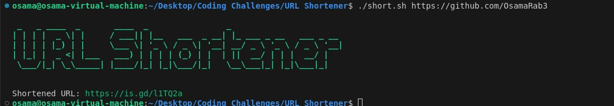

# URL Shortener

This is a simple Bash script that shortens a given URL using the `is.gd` URL shortening service. The script takes a long URL as input and returns a shortened version of the URL.

## Features

- Shortens URLs using the `is.gd` service.
- Displays the shortened URL with color formatting in the terminal.
- Uses `figlet` to display a stylized title.

## Prerequisites

- **Bash**: This script runs in a Bash environment.
- **curl**: Used to make HTTP requests to the `is.gd` API. It should be pre-installed on most Unix-like systems.
- **figlet**: Used to display the title in a stylized format. Install it using the following commands:
-  `jq` - For handling URL encoding (optional, if your URLs contain special characters)

### Installing figlet

- On **Ubuntu/Debian**:
  ```bash
  sudo apt-get install figlet
  ```
### Installing `jq`
- On **Ubuntu/Debian**:
  ```bash
   sudo apt-get install jq
   ```
## Usage
1. Clone the repository (or create the script file):
```bash 
git clone https://github.com/OsamaRab3/Coding-Challenges.git

cd Coding-Challenges/URL\ Shortener
```
2. Make the script executable:
```bash
chmod +x short.sh
```
3. Run the script with a URL to shorten:
```bash
./short.sh "https://github.com/OsamaRab3"
``` 

4. The script will output the shortened URL in green, and you can click on the link to be redirected to the original URL.



