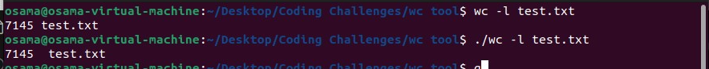
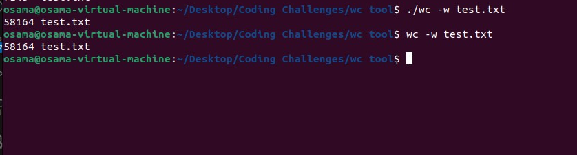
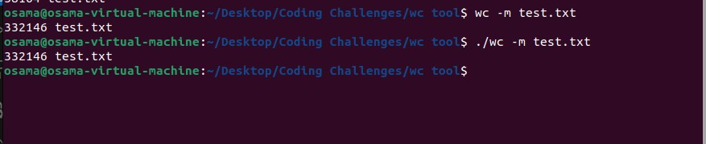
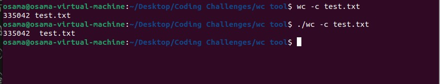
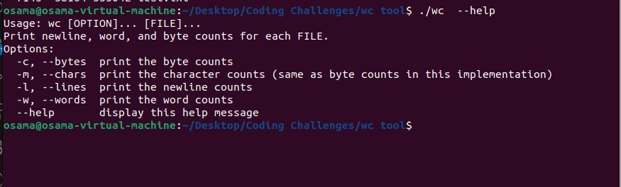

# Build Your Own `wc` Tool

## Overview

This project involves creating a custom version of the Unix command-line tool `wc`. The `wc` (word count) command is used to count the number of lines, words, and bytes (or characters) in files. This challenge is to build a simplified version of `wc` that supports some basic options.

The tool will read a file and output counts for:
- Number of lines
- Number of words
- Number of characters (for UTF-8 encoded files)
- Number of bytes

## Features

- **Count Lines** (`-l`): Counts the number of newline characters in the file.
- **Count Words** (`-w`): Counts the number of words in the file. A word is defined as a non-zero-length sequence of characters delimited by whitespace.
- **Count Characters** (`-m`): Counts the number of characters in the file. For UTF-8 encoded files, this is the number of Unicode characters.
- **Count Bytes** (`-c`): Counts the number of bytes in the file.
- **Help** (`--help`): Displays usage information and options for the tool.

## Usage
Use the following command:

```bash
gcc ccwc.c -o wc
```

### Examples
1. Count Lines in a File
```bash 
./wc -l test.txt 
```


2.  Count Words in a File
```bash 
./wc -w test.txt 
```


3. Count Characters in a File
```bash 
./wc -m test.txt 
```


4. Count Bytes in a File

```bash 
./wc -c test.txt 
```


5. Default wc Behavior
```bash 
./wc test.txt 
```


6. Display Help Information
```bash 
./wc --help 
```


7.  Read from standard input
```bash 
cat test.txt |./wc
```


## Contributing
Feel free to contribute to this project by submitting pull requests or opening issues for improvements and bug fixes.


